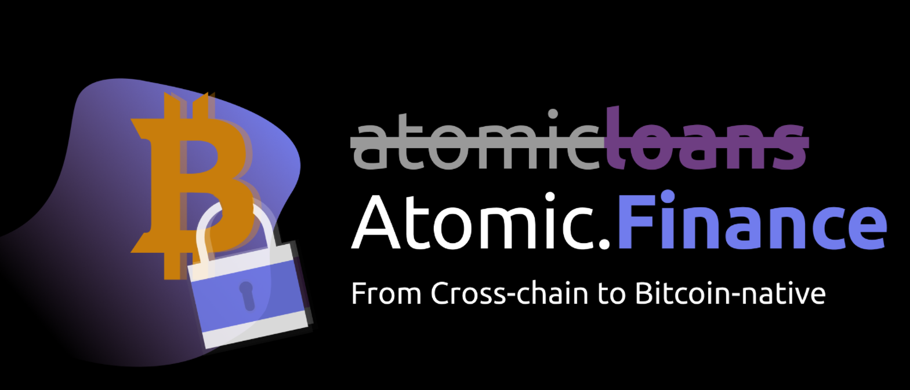

# Case Study - Atomic Finance

## Overview 
----

Atomic Finance was founded by two students from University of Waterloo in 2019. The co-founders, Tony Cai and Matthew Black, aim to create a sound financial infrastructure that facilitates decentralized and Bitcoin-backed financing. As a Canadian-based FinTech startup, Atomic Finance has risen $2.7 millions mainly from Initialized Capital and ConsenSys by the end of August 2021.

## Backgroud
----
The initiative for creating Bitcoin is to provide an alternative for the traditional centralized financial system. The Bitcoin market creates a bankless system where people could transfer money with less fees but more autonomy. However, the financial tools on Bitcoin have became a totally different story. Most of Bitcoin-based lending activities are processed by centralized platforms. These platforms act as crypto banks that request users to deposit their BTC before lending or borrowing, which is the opposite way that Bitcoin originally pursued.

The reason above became the root for the rise of decentralized finance (DeFi). Ethereum not only creates ETH for trading like BTC, but also proivdes an open -source technology and non-custodial solution for its followers to build a transparent money-market where they can borrow, save, invest, and trade. 

In the meantime, Bitcoin as the first cryptocurrency in the world still has challenges to build its own financial infrastructure. Simple, primitive and secure are the advantages for people to choose trading in BTC instead of other cryptocurrencies. But, this stack-based language makes more difficult to build new applications on top of Bitcoin.  

## Origin
----
So, for BTC owners, how to receive a Bitcoin-based loan that is not provided by crypto bank while not to give up the ownership of their BTC?

The Atomic Loans, the former Atomic Finance, introduced a new way to the Bitcoin market by creating the protocol to overcross platforms between Bitcoin and ETH DeFi. It allowed users to lock their BTC in a non-custodial escrow and borrow from Ethereum stablecoin, which helped users to improve cashflow and obtain liquidity without selling their BTC. 

Building cross platforms protocol is hard. But, the demand from Bitcoin marktet is huge. So, Atomic Loans received $2.5 millions seed investment from Initialized Capital, ConsenSys, and other 8 investors in April 2020.

## From Atomic Loans to Atomic Finance
### From Cross-chain to Bitcoin-native
----
The fall of 2020 became the turning point for Atomic because Ethereum might force Atomic Loans to lauch tokens to stimulate and maximize the short-term liquidity. The potential changes could cause many problems, including increase the uncertainty and risk the sustainability. The co-funders of Atomic Loans realized the beliefs of DeFi have gone down a different path.

Tony Cai and Matthew Black started to review their initiative in the first place. Their goal was to build a sound financial infrastructure that would be 'same assurances (being verifiable, pseudo-anonymous, borderless, censorship- and seizure-resistant, and of course, maintains Bitcoin's sacred 21M supply cap)'. 

Thus, the cross-chain approach Atomic Loans built to connect to ETH DeFi was not suitable for the vision that company announced in the first place anymore. It's the crucial moment for Atomic Loans to decide the right path for the future.

Fortunately, Tony Cai and Matthew Black decided to stick to the way that Bitcoin taught them. They selected the Bitcoin-native approach to build future products, which is to build non-custodial finance natively on Bitcoin. The first product, Atomic Odds, has lauched its first version for testing in June 2021. The waiting list for the product continues growing.

The lauch of Atomic Odds is just the first step to build the 'self-sovereign Bitcoin-native financial tools'. The name, Atomic Loans, can no longer represent the purpose of the company. Atomic Finance is the beginnings of the new journey.

## Sources
----
1.	AtomicLoans:  https://atomic.loans/blog/
2.	Crunchbase:  https://www.crunchbase.com/organization/atomic-loans 
3.	Atomic.Finance: https://atomic.finance/
4.	Ethereum: https://ethereum.org/en/defi/
5.  ATOMIC LOANS RAISES $3.4 MILLION CAD AS IT LOOKS TO BRING DECENTRALIZED FINANCE TO BITCOIN MARKET: https://betakit.com/atomic-loans-raises-3-4-million-cad-as-it-looks-to-bring-decentralized-finance-to-bitcoin-market/
6. The 10 Most Important Cryptocurrencies Other Than Bitcoin: https://www.investopedia.com/tech/most-important-cryptocurrencies-other-than-bitcoin/

