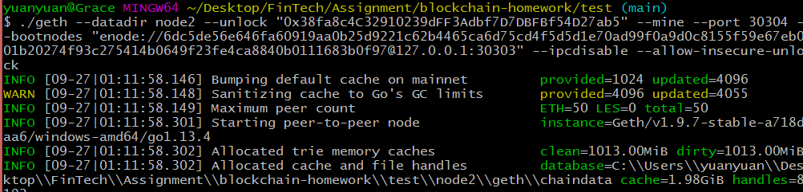
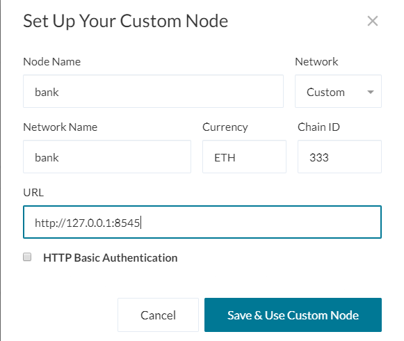

# Unit 18 | Instruction to Set up a Testnet Blockchain for Windows Users

## Part 1: Download necessary sotfware tools
----------
Before you start to build blockchain, please make sure you have the following softwares installed properly.

1. Git Bash: https://gitforwindows.org/
   
   ** Please do not use the default Windows command prompt to execute commands for building blockchains

2. MyCrypto Desktop App: https://download.mycrypto.com/

   Once you successfully install the App, please create new wallet and account for testing transactions later.

3. Go Ethereum Tools: https://geth.ethereum.org/downloads/

   a. Download "Geth & Tools 1.9.7" (Choose the right Arch version for your computer)
   
   b. Save the folder in a location that could be easily accessed since you will need it to build blockchain directly (Recommended)

   c. Rename the folder to 'Blockchain'

## Part 2: Build the Blockchain
------------
### Step 1: Open Git Bash and navigate to the 'test' folder

### Step 2: Create two nodes

1. Generate Node 1 and Node 2 by using the `geth` command and run separately

    `./geth account new --datadir node1`

    `./geth account new --datadir node2`

2. Set password for each Node

    ** Save both public and secret keys for each Node for later use

    ** Do not share the secret key with others

### Step 3: Create a Genesis Block

1. Active 'puppeth', a tool bundled with the Go Ethereum tool
   
   `./puppeth`

2. Type in the name `test` for the testnet

    ** Keep this name for later use

3. Choose option 2  `Configure new genesis`

4. Choose option 1 `Create new genesis from scratch`

5. Choose option 2 `Clique - proof-of-authority` for creating test network

6. Enter the number of seconds that blocks should take (default = 15)

7. Paste the public keys of two Nodes to seal and pre-fund the accounts
 
   a. Paste both account addresses from the 'Step 2' one at a time into the list of accounts to seal

   b. Paste them again in the list of accounts to pre-fund. There are no block rewards in PoA, so you'll need to pre-fund

8. Entry `no`  for pre-funding the pre-compiled accounts (0x1 .. 0xff) with wei. This keeps the genesis cleaner. Or, you can click enter to continue with the default option

9. Set the chain/network ID as `333` 

    ** Keep this ID for later use

10. New block is created successfully if you see a success message and be redirected to the original prompt:

### Step 4: Export Genesis Configurations

1. Choose option 2 ` Manage existing genesis` in the `puppeth` prompt

2. Choose option 2 `Export genesis configurations` to export

3. Type folder name to save the genesis specs (Or, click enter to save them in the current location)

   This will fail to create two of the files, but you only need `test.json`. 
   
   You can delete the `test-harmony.json` file.

4. Exit `puppeth` by using the `Ctrl+C` keys combination.

### Step 5: Initialize Each Node

1. Initialize the node 1

   ` ./geth init test.json --datadir node1`

2. Initialize the node 2
   
   ` ./geth init test.json --datadir node2`

You shall see the success message:

### Step 6: Start mining

1. Run the Node 1, unlock the account, enable mining, and the RPC flag. Only one node needs RPC enabled

   `./geth --datadir node1 --unlock "<replace your Node 1 public address>" --mine --rpc --allow-insecure-unlock`

You should see the node Committing new mining work:

2. Open a new Git Bash and navigate to the 'Blockchain' folder

3. Run the Node 2, unlock the account, enable mining, and use the first node's enode address as the bootnode flag

   `./geth --datadir node2 --unlock "<replace your Node 2 public address>" --mine --port 30304 --bootnodes "enode://<replace with node 1 enode address>" --ipcdisable --allow-insecure-unlock`

## Part 3: Transact on Your Chain
---------

### Step 1: Set up the Custom Node in MyCrypto

1. Open up MyCrypto

2. Select `Change Network`

3. Select `Add Custom Node` to add the custom network information as follows:

    ** The chain ID must match what you came up with earlier
    
    ** The URL must point to the default RPC port on your local machine. Use http://127.0.0.1:8545

4. Click `Save & Use Custom Node` button

### Step 2: Unlock the Node 1

1. Make sure you are now connect to the test network `bank` you just created 

   If not, click 'Change network' and choose the test network `bank` you just created

2. Select `View & Send` on the left

3. Select `Keystore File` at the bottom

4. Click ` SELECT WALLET FILE`

   a. Navigate to the UTC file for Node 1 (In the `keystore` folder)

   b. Enter the password you set for Node 1 

   c. Click `Unlock`

### Step 3: Test for Transaction 

This test transaction will send ETH from Node 1 to Node 2

1. Copy and paste the Node 2 public address into the `To Address`

2. Entry any amount and confirm the transaction

3. Click `TX Status` to check the payment status

4. You should see the transaction go from Pending to Successful in around the same blocktime you set in the genesis.

   You can click the Check TX Status button to update the status.

   a. Before sending:
   
      Node 1: 

      Note 2:

   b. After sending:

      Node 1: 

      Note 2:

